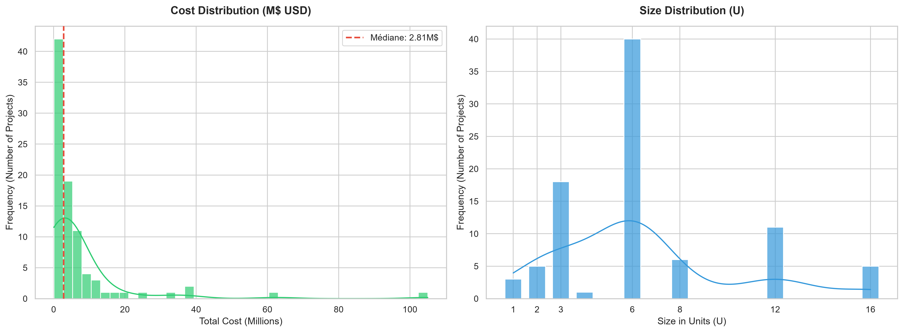
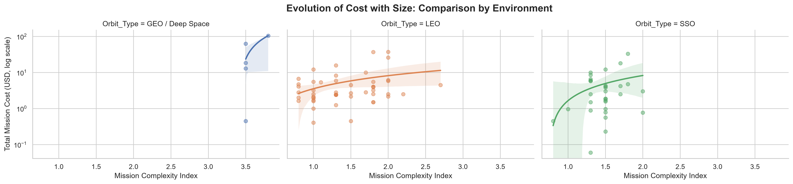
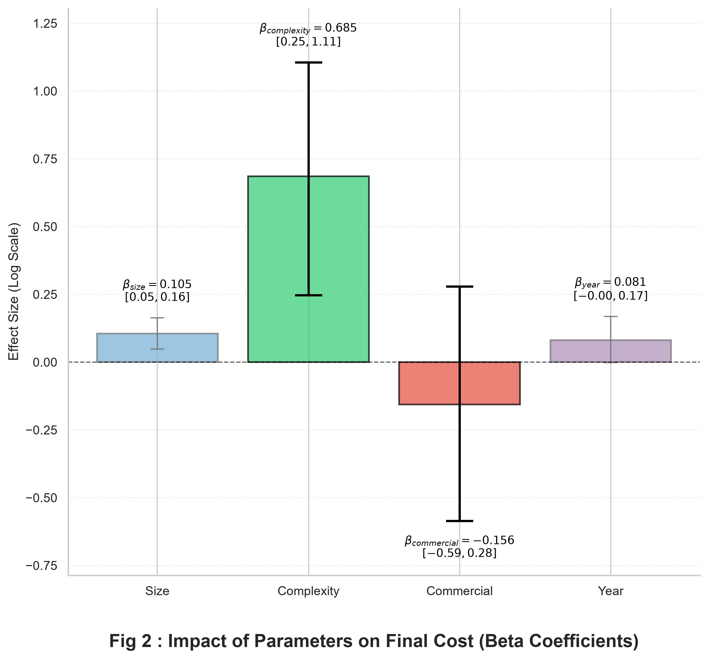
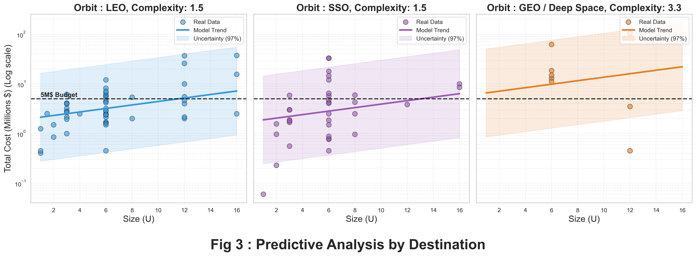
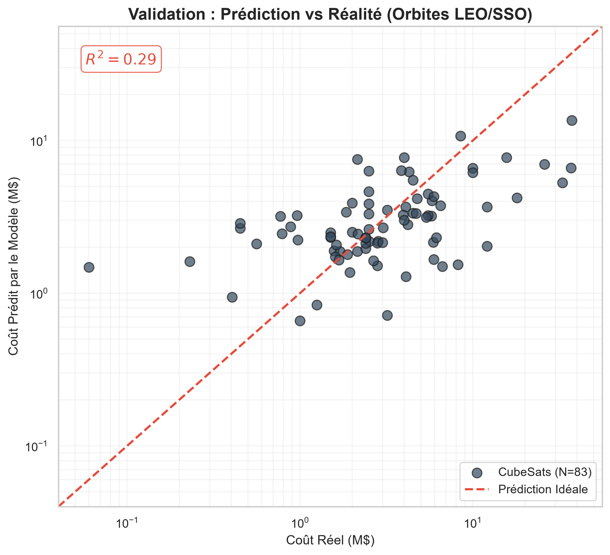
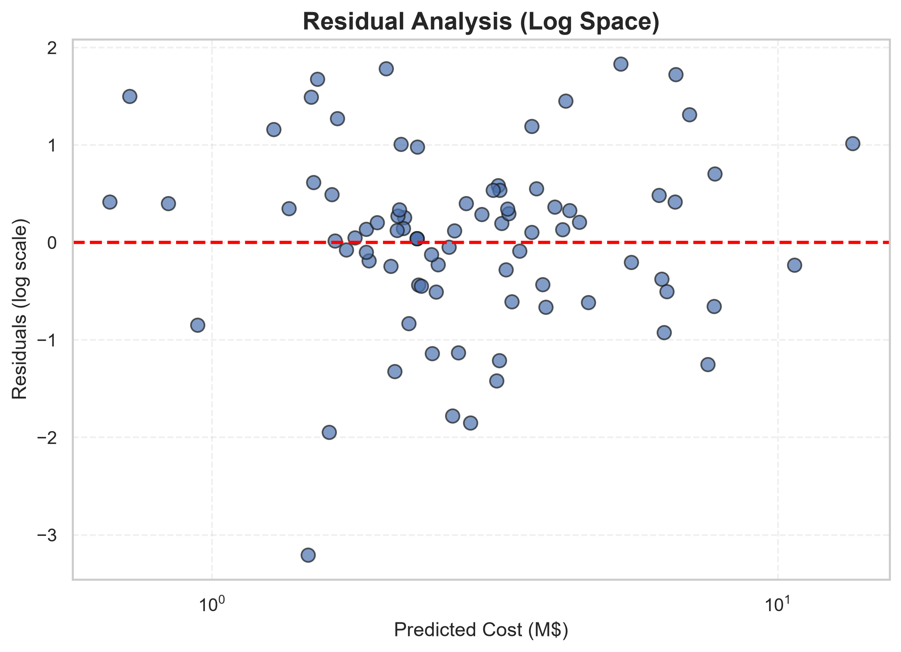
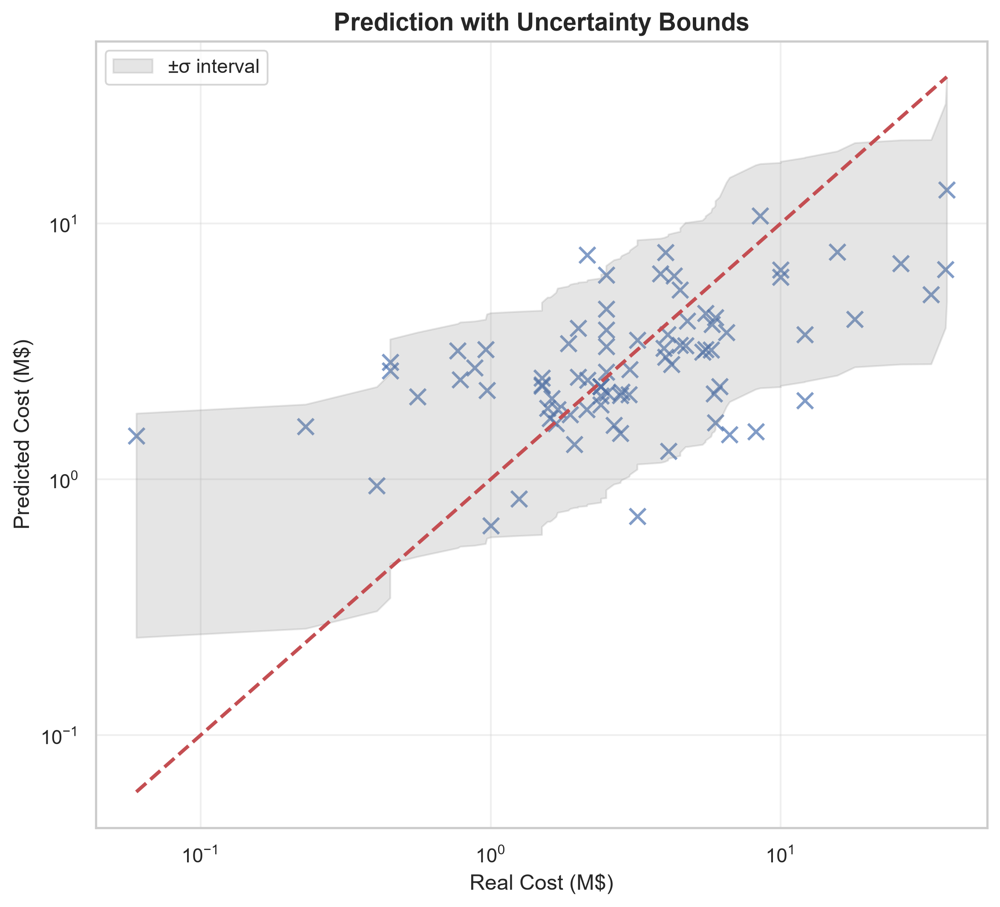

# 🚀 What Can You Really Do With 5M$ in Space?
### A Bayesian Decision Model for CubeSat Mission Design

**Author:** BRAVO Diego

**Affiliation:** Lycée Saint-Guilhem / Hérault / FRANCE

**Context:** ESA–CNES Student Poster Challenge 2026  

---

## 📌 Table of Contents
* [🧭 1. Project Overview](#-1-project-overview)
* [🎯 2. Objective](#-2-objective)
* [🛰️ 3. Dataset Construction](#%EF%B8%8F-3-dataset-construction)
* [📈 4. Exploratory Data Analysis](#-4-exploratory-data-analysis)
* [🧠 5. Model Description](#-5-model-description)
* [⚙️ 6. Model Inputs](#%EF%B8%8F-6-model-inputs)
* [📊 7. Parameter Analysis](#-7-parameter-analysis)
* [🌍 8. Role of Orbit](#-8-role-of-orbit)
* [📉 9. Predictive Behavior](#-9-predictive-behavior)
* [💰 10. Decision Scenario: 5M$ Budget](#-10-decision-scenario-5m-budget)
* [📏 11. Model Validation](#-11-model-validation)
* [📌 12. Key Insights](#-12-key-insights)
* [⚠️ 13. Limitations](#%EF%B8%8F-13-limitations)
* [🚀 14. Perspectives](#-14-perspectives)
* [🔗 15. Reproducibility](#-15-reproducibility)
* [🧩 16. Additional Visualizations](#-16-additional-visualizations)
* [📚 17. References](#-17-references)
* [📬 Contact](#-contact)

---

## 🧭 1. Project Overview

CubeSat missions exhibit significant cost variability, ranging from less than 0.1M$ to over 100M$.  
In the context of New Space, designing missions under strict budget constraints has become a central challenge.

Traditional cost estimation methods are often inaccessible in early design phases, especially in academic or student-led projects.

👉 This project proposes a **data-driven and interpretable model** to:
- Estimate CubeSat mission cost
- Quantify uncertainty
- Support early-stage design decisions under budget constraints

---

## 🎯 2. Objective

The main objective is to answer a simple but practical question:

> **What kind of space mission can realistically be achieved with a fixed budget (e.g. 5M$)?**

To address this, a **Bayesian log-normal regression model** is developed and used as a **decision-support tool**.

---

## 🛰️ 3. Dataset Construction

A dataset of approximately **~90 CubeSat missions** was manually constructed using public sources.

### 📊 Features included ans used in the model:
- **Platform size** (1U to 16U)
- **Orbit type** (LEO, SSO, GEO, Deep Space)
- **Mission type**
- **Complexity score** *(constructed index)*
- **Total mission cost (USD)**

### 🧹 Data processing:
- Standardization of heterogeneous sources
- Currency normalization
- Handling missing values
- Manual curation of mission characteristics

### 📌 Note:
- GEO and Deep Space missions were grouped due to limited data and similar cost structures

### ⚙️ Complexity Index: `calculate_clean_complexity(row)`
**File location:** `src/dataset_cleaner.py`  
**Objective:** Computes a standardized numerical complexity score (starting at `1.0`) based on payload objectives and institutional overhead.

#### 1. Payload & Mission Type Bonus
The script checks the `Mission_Type` string and adds a fixed modifier to the baseline score:
* **Technology Demo:** `+0.0`
* **Communications:** `+0.3`
* **Earth Observation:** `+0.5`
* **Military/Defense:** `+0.7`
* **Science/Astronomy:** `+1.0`
* **Deep Space / GEO:** `+2.0` *(grouped due to similar radiation/shielding constraints and sparse data)*

#### 2. Institutional & Manufacturing Adjustments
The script scans `Organization` and `Manufactured (AIVT) by` to adjust for quality assurance overhead and labor costs:

* **Space Agencies & Military** (`nasa`, `esa`, `cnes`, `darpa`, `dlr`, `air force`, `defence`):
  * `+0.7` if combined with a "Science/Astronomy" mission.
  * `+0.5` for any other mission type.
* **Academic Institutions** (`university`, `ecole`, `politecnico`, `college`, `instit`, `in-house`):
  * `-0.2` discount due to educational free labor and reduced documentation.
  * **Exception:** The `-0.2` discount is **canceled** if the platform is outsourced to a commercial turnkey manufacturer (`gomspace`, `clyde`, `nanoavionics`).

---

## 📈 4. Exploratory Data Analysis

### 🔹Distribution of total Cost and Distribution of mission sizes

    

### 🔹 Cost vs Complexity across orbits

    

👉 Key observation:
- Mission cost increases **non-linearly** with complexity
- Higher orbits introduce **structural cost shifts**

---

## 🧠 5. Model Description

A **Bayesian log-normal regression model** is used to estimate mission cost.

### 🔹 Model formulation

$\ln(\text{Cost}) = \alpha_{\text{orbit}} + \beta_{\text{size}} \cdot \text{Size} + \beta_{\text{complexity}} \cdot \text{Complexity} + \beta_{\text{commercial}} \cdot \text{Commercial} + \beta_{\text{year}} \cdot \text{Year} + \epsilon$

### 🔹 Why this model?

- Captures **multiplicative cost effects**
- Reflects **exponential scaling** of mission budgets
- Ensures **strictly positive predictions**
- Provides **uncertainty estimates** via Bayesian inference

---

## ⚙️ 6. Model Inputs

- **Orbit** → environmental and operational constraints  
- **Size (U)** → platform scale  
- **Complexity** → technological difficulty  
- **Commercial status** → shared infrastructure effects  
- **Year** → temporal trend  

---

## 📊 7. Parameter Analysis

    

### 🔹 Key findings:

- **Complexity** is the dominant driver of cost  
- **Size** has a moderate but consistent effect  
- **Commercial missions** tend to be slightly cheaper (shared infrastructure)  
- **Year effect** is weak / not significant  

👉 Example:

> +1 level of complexity → cost ×2.0 (on average)

---

## 🌍 8. Role of Orbit

Orbit introduces strong structural constraints:

- **LEO / SSO** → lower baseline cost  
- **GEO / Deep Space** → significantly higher cost  

👉 Reason:
- Increased communication requirements  
- Higher reliability constraints  
- Radiation protection  
- Longer mission duration  

---

## 📉 9. Predictive Behavior

    

### Observations:

- Cost increases with size, but moderately  
- Complexity drives **exponential growth**  
- Uncertainty increases for extreme missions (Deep Space, GEO)  

---

## 💰 10. Decision Scenario: 5M$ Budget

A practical case study was conducted using a fixed budget of **5M$**.

### Assumptions:
- Platform: 6U CubeSat  
- Commercial mission: Yes  
- Year: 2026  
- Orbit-specific complexity  

---

### 📊 Estimated costs (±1σ uncertainty ≈ 68%)

| Mission Type        | Orbit              | Estimated Cost (M$) | Feasible |
|--------------------|-------------------|---------------------|----------|
| Tech Demo (1.2)    | LEO               | 1.15 - 8.62          | ✅ Yes   |
| Earth Obs (1.5)    | SSO               | 1.58 - 11.85           | ⚠️ Limited |
| Science (2.2)      | GEO / Deep Space  | 1.96 - 14.76           | ❌ No    |
| Deep Space (3.2+)  | GEO / Deep Space  | 5.12 - 38.51           | ❌ No    |

👉 Interpretation:
- Low-complexity missions are feasible under tight budgets  
- High-complexity missions quickly exceed constraints  
- Orbit transition significantly increases cost pressure  

---
## 📏 11. Model Validation

### 🔹 Coverage of uncertainty intervals

To evaluate the reliability of the probabilistic predictions, we measure how many real observations fall within the model’s predicted uncertainty ranges.

Using a ±2σ interval (≈95% confidence for a log-normal distribution):

> **97.6% of observed mission costs fall within predicted bounds**

👉 Interpretation:
- The model provides **realistic uncertainty estimates**
- It captures the **high variability of space mission costs**

⚠️ However:  
This high coverage is partly explained by the **large dispersion of costs** in New Space missions, rather than purely high predictive precision.

---

### 🔹 Goodness of fit (R²)

A coefficient of determination (R²) was computed on log-transformed costs:

> **R² ≈ 0.29**

👉 Interpretation:
- A moderate R² reflects the **intrinsic variability** of space mission costs  
- Some cost drivers are not included in the model (e.g. payload, propulsion, reliability constraints)

⚠️ Important note:  
R² is not the most relevant metric for Bayesian log-normal models,  
as the objective is not only predictive accuracy but also **uncertainty quantification and interpretability**.

---

### 🔹 Key takeaway

This model should be interpreted as a:

> **Decision-support tool with calibrated uncertainty**,  
rather than a precise cost prediction system.

## 📌 12. Key Insights

- Mission cost scales **exponentially with complexity**  
- Orbit imposes **strong structural constraints**  
- Size plays a **secondary role**  
- Simple models can support **early-stage decision-making**

---

## ⚠️ 13. Limitations

- Limited dataset (~90 missions)  
- Few Deep Space observations  
- Complexity is a **constructed proxy**  
- Simplified model (no subsystem-level detail)  
- High cost dispersion inherent to space missions  

---

## 🚀 14. Perspectives

- Integrate **subsystem-level cost drivers** (payload, ADCS, power)  
- Expand dataset with **industrial data**  
- Develop a **design-to-cost decision framework**  
- Apply model to **CubeSat mission planning tools**  

---

## 🔗 15. Reproducibility

All data, code, and analysis are available in this repository.

👉 The model can be reused and extended for:
- Other budget scenarios
- Different mission profiles
- Educational or research purposes

---

## 🧩 16. Additional Visualizations

| Visualization | Description |
|--------------|------------|
|  | **Cost vs Size (global)** Shows the overall scaling of cost with platform size. |
|  | **Prediction vs Actual (log-log)** Evaluates how well the model reproduces real mission costs. |
|  | **Residual analysis (log space)** Assesses model errors and potential biases. |
|  | **Prediction with Uncertainty Bounds** Compares predicted vs. actual costs on a log-log scale with a $\pm1\sigma$ multiplicative error band to show model coverage. |

---

👉 These visualizations are not included in the poster for clarity,  
but provide deeper insight into model performance and limitations.

---

## 📚 17. References

European Space Agency. (2023). *CubeSat missions and engineering support*. [ESA Technology Publications](https://www.esa.int/Enabling_Support/Space_Engineering_Technology/CubeSats).

Centre National d'Études Spatiales. (2022). *Nano-satellite and small mission engineering*. [CNES Technologie by Nanolab Academy](https://cnes.fr/projets/nanolab-academy/plateforme-seed-projets).

Swartwout, M. (2014). The first one hundred CubeSats: A statistical look. *Proceedings of the AIAA/USU Conference on Small Satellites*. [Direct Access PDF](https://jossonline.com/storage/2021/08/0202-Swartwout-The-First-One-Hundred-Cubesats.pdf).

NASA, JPL, California Institute of Technology. (2020). *NASA and Smallsat Cost Estimation Overview and Model Tools*. NASA Technical Reports Server. [Direct Access Document](https://www.nasa.gov/wp-content/uploads/2020/05/saing_nasa_and_smallsat_cost_estimation_overview_and_model_tools_s3vi_webinar_series_10_jun_2020.pdf).

Kulu, Erik. « CubeSat Tables ». Nanosats Database, https://www.nanosats.eu/tables.html. Accessed on April 23, 2026.

---

### 📜 Data Sources & Primary References

All baseline cost and structural data for this model were compiled from the **Nanosats Database** (Kulu, E., 2024, www.nanosats.eu). 

The specific mission reports, press releases, and articles used to build the dataset can be verified via their primary documentation links below:
| Satellite Name | Size | Primary Documentation / Source Link |
| :--- | :--- | :--- |
| **AeroCube-15** | 3U | [Source Document / Article](https://digitalcommons.usu.edu/cgi/viewcontent.cgi?article=4718&context=smallsat) |
| **AISTECHSAT (DANU) 2U** | 2U | [Source Document / Article](https://gomspace.com/news/aistech-places-order-at-the-sum-of-200000-wit.aspx) |
| **Amber** | 6U | [Source Document / Article](https://horizontechnologies.eu/aac-clyde-space-wins-4-6-mgbp-order-from-horizon-technologies/) |
| **IOD Mission 3** | 6U | [Source Document / Article](https://www.clyde.space/latest/56-clyde-space-catapults-to-more-success) |
| **BlackCAT** | 6U | [Source Document / Article](https://www.psu.edu/news/research/story/penn-state-astrophysicist-lead-58-million-nasa-cubesat-mission/) |
| **BRO** | 6U | [Source Document / Article](https://gomspace.com/news/gomspace-signs-contract-with-unseenlabs-to-de.aspx) |
| **Buccaneer** | 6U | [Source Document / Article](https://www.criticalcomms.com.au/content/research/news/inovor-to-deliver-satellite-bus-for-buccaneer-project-1333916370#axzz66zQjL8U6) |
| **CTOS** | 8U | [Source Document / Article](https://spaceq.ca/galaxia-lands-2-5m-drdc-contract-to-build-tactical-leo-satellite/) |
| **CatSat** | 6U | [Source Document / Article](https://gomspace.com/news/gomspace-leads-development-of-a-teaming-agreement-.aspx) |
| **Exoterra CubeSat** | 12U | [Source Document / Article](https://www.nasa.gov/press-release/nasa-announces-new-tipping-point-partnerships-for-moon-and-mars-technologies) |
| **CUTE** | 6U | [Source Document / Article](https://spacenews.com/cubesat-offers-template-for-future-astronomy-missions/) |
| **DAILI** | 6U (1x6U) | [Source Document / Article](https://aerospace.org/press-release/aerospace-gets-28m-nasa-grant-study-atmosphere) |
| **AISTECHSAT (DANU) 2U** | 2U | [Source Document / Article](https://gomspace.com/news/gomspace-and-aistech-sign-new-agreement.aspx) |
| **Deorbitsail** | 3U | [Source Document / Article](https://cordis.europa.eu/project/rcn/97975/reporting/en) |
| **Diamond 6U (Sky and Space Global)** | 6U | [Source Document / Article](https://gomspace.com/news/6u-agreement-between-gomspace-and-sky-and-spa.aspx) |
| **DOVER** | 3U | Documentation non disponible |
| **DUPLEX** | 6U | [Source Document / Article](https://aerospace.illinois.edu/news/nasa-funds-long-standing-partners-cubesat-development?fbclid=IwAR1Fd1cpimSsh19dRQfbJpp5dSAj2M2bDkqmViQ5EYdYxYwBEzn8tMKytPo) |
| **E.T.PACK DMM & EEM** | 12U | [Source Document / Article](https://digitalcommons.usu.edu/cgi/viewcontent.cgi?article=5419&context=smallsat) |
| **Edison** | 8U | [Source Document / Article](https://www.linkedin.com/posts/space-inventor_we-are-happy-to-announce-that-space-inventor-activity-6762415859404181505-M2qs/) |
| **EIRSAT-1** | 2U | [Source Document / Article](https://europeanspaceflight.com/ireland-commit-3-3m-euros-more-to-esa-for-2024/) |
| **EPICHyper** | 6U | [Source Document / Article](https://spacenews.com/aac-clyde-space-to-develop-cubesats-to-offer-array-of-services/) |
| **ET-SMART-RSS** | 6U | Documentation non disponible |
| **FACSAT** | 6U | [Source Document / Article](https://gomspace.com/news/the-colombian-air-force-initiates-its-second-.aspx) |
| **Faraday-1** | 6U | [Source Document / Article](https://www.gov.uk/government/news/british-built-satellites-will-help-fight-climate-change-and-save-wildlife) |
| **GEMS (Orbital Micro Systems)** | 6U | [Source Document / Article](https://investor.aac-clyde.space/en/press-releases/aac-clyde-space-wins-8-msek-order-for-commercial-satellite-75931) |
| **GOMX-5** | 8U | [Source Document / Article](https://gomspace.com/news/esa-and-gomspace-sign-contract-for-continuati.aspx) |
| **HAMMER (IOD6)** | 6U | [Source Document / Article](https://www.open-cosmos.com/news/open-cosmos-to-build-the-uk-pathfinder-atlantic-constellation-satellite-to-use-ai-to-improve-environmental-management) |
| **Hellenic Space Dawn** | 8U | [Source Document / Article](https://www.kathimerini.gr/society/562723270/erchetai-sminos-ellinikon-nanodoryforon/) |
| **HERMES-SP** | 3U | [Source Document / Article](https://cordis.europa.eu/project/rcn/218722/factsheet/en) |
| **Hyperion 1** | 12U | [Source Document / Article](https://www.minister.defence.gov.au/minister/melissa-price/media-releases/28-million-innovation-boost-australias-defence-industry) |
| **Infante** | 16U | [Source Document / Article](https://www.tekever.com/projects/infante/) |
| **InspireSAT** | 12U | [Source Document / Article](https://spaceq.ca/starspec-12u-inspiresat-demo-satellite-launch-expected-mid-2027/) |
| **Intuition-1** | 6U | [Source Document / Article](http://investor.aacmicrotec.com/pressmeddelanden/aac-microtec-wins-5-msek-launch-order-from-kp-labs-69761?page=3) |
| **Io-1** | 4U | [Source Document / Article](https://investor.aac-clyde.space/en/press-releases/?slug=aac-clyde-space-wins-sek-25-5-m-order-for-magquest-mission-21158) |
| **Startical** | 16U | [Source Document / Article](https://gomspace.com/news/gomspace-has-been-chosen-to-develop-advanced-.aspx) |
| **GEMS (Orbital Micro Systems)** | 3U | Documentation non disponible |
| **IonSat** | 6U | [Source Document / Article](https://www.polytechnique.edu/recherche/chaires/les-chaires-de-transports-mobilites-et-espace/mecenat-denseignement-espace-science-et-defis-du-spatial/centre-spatial-de-lecole-polytechnique/ionsat) |
| **Juventas** | 6U | [Source Document / Article](https://spacewatch.global/2020/08/esa-and-gomspace-sign-contract-for-implementation-of-the-juventas-cubesat-in-support-of-the-hera-mission/) |
| **Kelpie** | 3U | [Source Document / Article](http://investor.aacmicrotec.com/pressmeddelanden/aac-microtec-to-deliver-enhanced-ais-data-exclusively-to-orb-70246) |
| **TARS (Kepler)** | 6U | Documentation non disponible |
| **Kleos Space - Polar Vigilance Mission (KSF1)** | 6U | [Source Document / Article](https://www.satellitetoday.com/launch/2020/10/23/kleos-space-selects-manufacturer-for-polar-vigilance-mission-ksf1-nanosatellite/) |
| **Kleos Scouting Mission (KSM1)** | 6U | [Source Document / Article](https://www.linkedin.com/feed/update/urn:li:activity:6449905862378164224/) |
| **KSS-BOBCAT** | 6U | [Source Document / Article](https://www.satelliteevolution.com/post/aac-clyde-space-wins-sek-16-1-m-satellite-order-from-kawa-space) |
| **KuwaitSat-1** | 2U | [Source Document / Article](https://english.news.cn/20220916/b70417c860e144e3a13ec34aaa421b69/c.html) |
| **LLITED** | 1.5U | [Source Document / Article](https://aerospace.org/press-release/aerospace-awarded-nasa-llited-grant) |
| **Lusiada (LusoSpace)** | 8U | [Source Document / Article](https://www.aac-clyde.space/articles/interim-report-for-aac-clyde-space-ab-publ-january-march-2024) |
| **M-ARGO** | 12U | [Source Document / Article](https://gomspace.com/news/gomspace-to-design-worlds-first-stand-alone-n.aspx) |
| **MACSAT** | 6U | [Source Document / Article](https://www.oqtec.space/news/oq-techsigns-2-million-euro-contract-with-esa) |
| **MANTIS (US)** | 16U | [Source Document / Article](https://lasp.colorado.edu/missions/mantis/) |
| **MarCO** | 6U | [Source Document / Article](https://mars.nasa.gov/news/8408/beyond-mars-the-mini-marco-spacecraft-fall-silent/) |
| **MH-1 (AEROS)** | 3U | [Source Document / Article](https://cmuportugal.org/media/mh-1-the-first-satellite-totally-developed-in-portugal-was-launched-to-space/) |
| **MIR-SAT1** | 1U | [Source Document / Article](http://investor.aacmicrotec.com/pressmeddelanden/aac-microtec-formalizes-collaboration-with-mauritius-researc-67858?page=4) |
| **MOBIUS** | 3U | [Source Document / Article](https://spaceq.ca/galaxias-mobius-1-progresses-towards-june-launch/) |
| **NanoMagSat** | 16U | [Source Document / Article](https://www.ipgp.fr/en/news-and-agenda/news/la-mission-nanomagsat-obtient-le-feu-vert-de-lesa/) |
| **NARSSCube-2** | 1U | [Source Document / Article](http://satelliteprome.com/news/egypt-sends-cubesat-to-international-space-station/) |
| **NEPTUNO** | 3U | [Source Document / Article](https://elecnor-deimos.com/portfolio/neptuno/) |
| **NSLSat** | 6U | [Source Document / Article](https://investor.aac-clyde.space/en/press-releases/aac-clyde-space-wins-15-msek-satellite-order-from-nslcomm-74601) |
| **OPS-SAT** | 3U | [Source Document / Article](https://www.eurekalert.org/pub_releases/2019-12/guot-ssl121819.php) |
| **OPS-SAT VOLT** | 16U | [Source Document / Article](https://www.aac-clyde.space/articles/interim-report-for-aac-clyde-space-ab-publ-january-march-2024) |
| **ORCA-8** | 6U | [Source Document / Article](https://www.aflcmc.af.mil/News/Article-Display/Article/2034623/afrl-technology-set-for-launch-to-international-space-station/) |
| **Outernet 1U** | 1U | [Source Document / Article](http://www.spacedaily.com/reports/Clyde_Space_wins_Outernet_contract_999.html) |
| **PEARLS (Sky and Space Global)** | 8U | [Source Document / Article](https://gomspace.com/news/6u-agreement-between-gomspace-and-sky-and-spa.aspx) |
| **Phasma** | 3U | [Source Document / Article](https://news.satnews.com/2023/07/20/libre-space-foundations-2-million-euros-phasma-project-with-esa-for-development-of-three-open-source-cubesats/) |
| **PIAST** | 6U | [Source Document / Article](https://spacenews.com/polish-armed-forces-enlist-industry-consortium-for-imaging-nanosatellites/) |
| **PIXL-1** | 3U | [Source Document / Article](https://gomspace.com/news/gomspace-closes-order-for-a-nano-satellite-pl.aspx) |
| **PolSIR** | 12U | [Source Document / Article](https://news.vanderbilt.edu/2023/05/25/vanderbilt-universitys-ralf-bennartz-to-lead-nasa-mission-to-study-ice-clouds/) |
| **PREFIRE** | 6U | [Source Document / Article](https://spacenews.com/rocket-lab-to-launch-pair-of-nasa-earth-science-cubesats/) |
| **RACE (ESA)** | 6U | [Source Document / Article](https://gomspace.com/news/gomspace-signs-contract-with-the-european-spa.aspx) |
| **SCOUT-1 (EPS-MACCS)** | 12U | [Source Document / Article](https://gomspace.com/news/esa-and-gomspace-sign-contract-to-implement-e.aspx) |
| **SeaHawk** | 3U | [Source Document / Article](http://www.satnews.com/story.php?number=972377587) |
| **SEAM** | 3U | [Source Document / Article](https://cordis.europa.eu/project/rcn/188846/factsheet/en) |
| **SOAR** | 3U | [Source Document / Article](https://discoverer.space/soar-satellite-for-orbital-aerodynamics-research/) |
| **SpIRIT** | 6U | [Source Document / Article](https://www.space.gov.au/australian-spirit-launches-to-space) |
| **SPRITE** | 12U | [Source Document / Article](https://spacenews.com/cubesat-offers-template-for-future-astronomy-missions/) |
| **SROC** | 12U | [Source Document / Article](https://terranorbital.com/terran-orbital-awarded-4-7-million-contract-by-european-space-agency/) |
| **SULIS** | 12U | [Source Document / Article](https://sulis.space/management-structure/) |
| **SunRISE** | 6U | [Source Document / Article](https://www.nasaspaceflight.com/2020/03/sunrise-mission-study-giant-solar-particle-storms/) |
| **SWARM-EX** | 3U | [Source Document / Article](https://digitalcommons.usu.edu/smallsat/2022/all2022/96/) |
| **TEMPEST-D** | 6U | [Source Document / Article](http://www.spacedaily.com/reports/Small_nimble_CSU_satellite_has_surpassed_a_year_in_space_999.html) |
| **Tiger-2** | 6U | [Source Document / Article](https://www.oqtec.space/news/oq-techsigns-2-million-euro-contract-with-esa) |
| **Tiger-4** | 6U | [Source Document / Article](https://www.oqtec.space/news/oq-techsigns-2-million-euro-contract-with-esa) |
| **Tiger-7** | 6U | [Source Document / Article](https://www.oqtec.space/news/oq-techsigns-2-million-euro-contract-with-esa) |
| **Tiger-8** | 6U | [Source Document / Article](https://www.oqtec.space/news/oq-techsigns-2-million-euro-contract-with-esa) |
| **UKube-1** | 3U | [Source Document / Article](https://assets.publishing.service.gov.uk/government/uploads/system/uploads/attachment_data/file/350503/National_Space_Programmes_2014_to_2015.pdf) |
| **VPM** | 6U | [Source Document / Article](https://www.aflcmc.af.mil/News/Article-Display/Article/2034623/afrl-technology-set-for-launch-to-international-space-station/) |
| **WindCube** | 6U | [Source Document / Article](https://digitalcommons.usu.edu/smallsat/2022/all2022/62/) |
| **xSPANCION** | 6U | [Source Document / Article](https://spacenews.com/aac-clyde-space-to-develop-cubesats-to-offer-array-of-services/) |
| **XVI** | 12U | [Source Document / Article](https://spacenews.com/viasat-selected-to-develop-military-link-16-communications-satellite-in-low-earth-orbit/) |
| **Ymir** | 3U | [Source Document / Article](https://investor.aac-clyde.space/en/press-releases/aac-clyde-space-saab-and-orbcomm-to-bring-the-next-generatio-79059) |

## 📬 Contact

[diego.bravo.contact@gmail.com](mailto:diego.bravo.contact@gmail.com)
